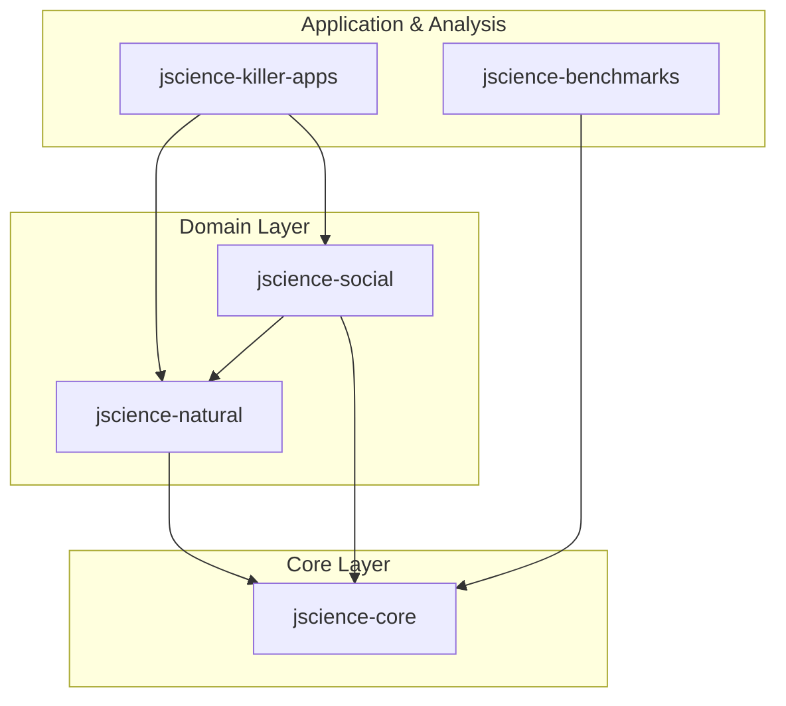

# JScience Architecture

JScience is a unified scientific computing framework for the Java(TM) platform. It follows a modular architecture designed for high-performance, type-safety, and extensibility across multiple scientific domains.

## Module Structure

The project is organized as a multi-module Maven system, where each module represents a specific layer of the scientific stack.

### [jscience-core](file:///c:/Silvere/Encours/Developpement/JScience/jscience-core)

The foundation of the framework. It provides:

- **Mathematics**: Abstract algebraic structures (Rings, Fields, Groups), Linear Algebra (Matrices, Vectors), and Symbolic Mathematics.
- **Physics**: Units of Measurement (JSR-385 integration), physical quantities, and fundamental constants.
- **I/O & Utilities**: Standardized loaders for Properties, JSON, and Protobuf, along with a unified `ComputeContext` for switching between CPU and GPU backends.

### [jscience-natural](file:///c:/Silvere/Encours/Developpement/JScience/jscience-natural)

Implements specific scientific disciplines using the core primitives:

- **Physics**: Classical mechanics, Quantum computing, and Relativity engines.
- **Chemistry**: Molecular modeling, periodic table data, and chemical reaction parsing.
- **Biology**: Sequence alignment, genetic modeling, and phylogenetic tree construction.
- **Earth & Space**: Geospatial data, earthquake modeling, and ephemeris tracking.

### [jscience-social](file:///c:/Silvere/Encours/Developpement/JScience/jscience-social)

Focuses on high-level simulations and the "human" aspect of science:

- **Economics**: Financial models and market simulations.
- **Sociology**: Population dynamics and social network analysis.
- **Engineering**: Architecture stability simulations and control systems.
- **Visuals**: often hosts the `Javalin` based web dashboards and complex demo UI controllers.

### [jscience-killer-apps](file:///c:/Silvere/Encours/Developpement/JScience/jscience-killer-apps)

A collection of end-user applications that demonstrate the full power of the JScience integration, from real-time data visualization to complex multi-physics simulations.

### [jscience-benchmarks](file:///c:/Silvere/Encours/Developpement/JScience/jscience-benchmarks)

Performance analysis module used to compare JScience operations (like FFT or Matrix multiplication) against industry standards like EJML, Apache Commons Math, and Colt.

## Key Design Principles

1. **Type-Safe Measurements**: Leveraging Java generics to ensure that physical dimensions (e.g., adding Meters to Seconds) are caught at compile-time.
2. **Pluggable Backends**: Computational kernels can be swapped between pure Java, CUDA, or OpenCL via the `LinearAlgebraRegistry`.
3. **transitive Dependency Management**: Modules are layered such that `natural` and `social` build upon the robust mathematical foundations of `core`.
4. **Data-Driven Logic**: Heavy use of external data files (JSON/XML/PDB) for scientific data, separated from the computational algorithms.
