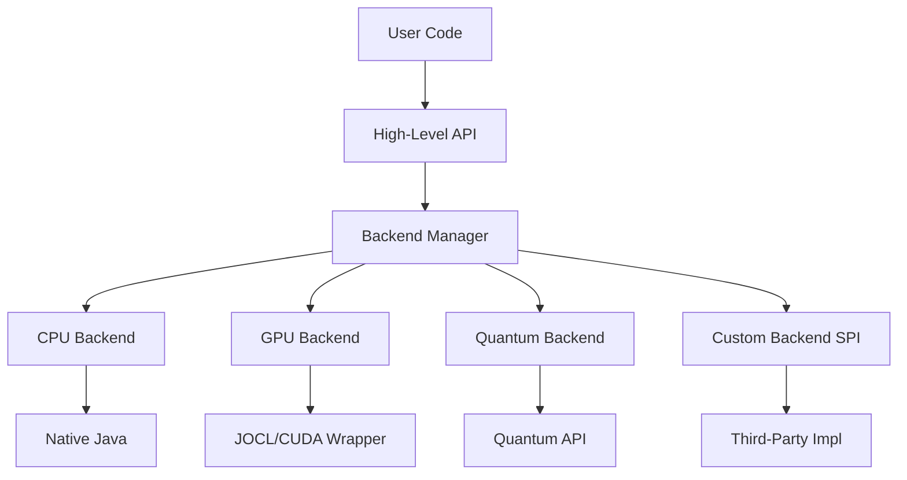
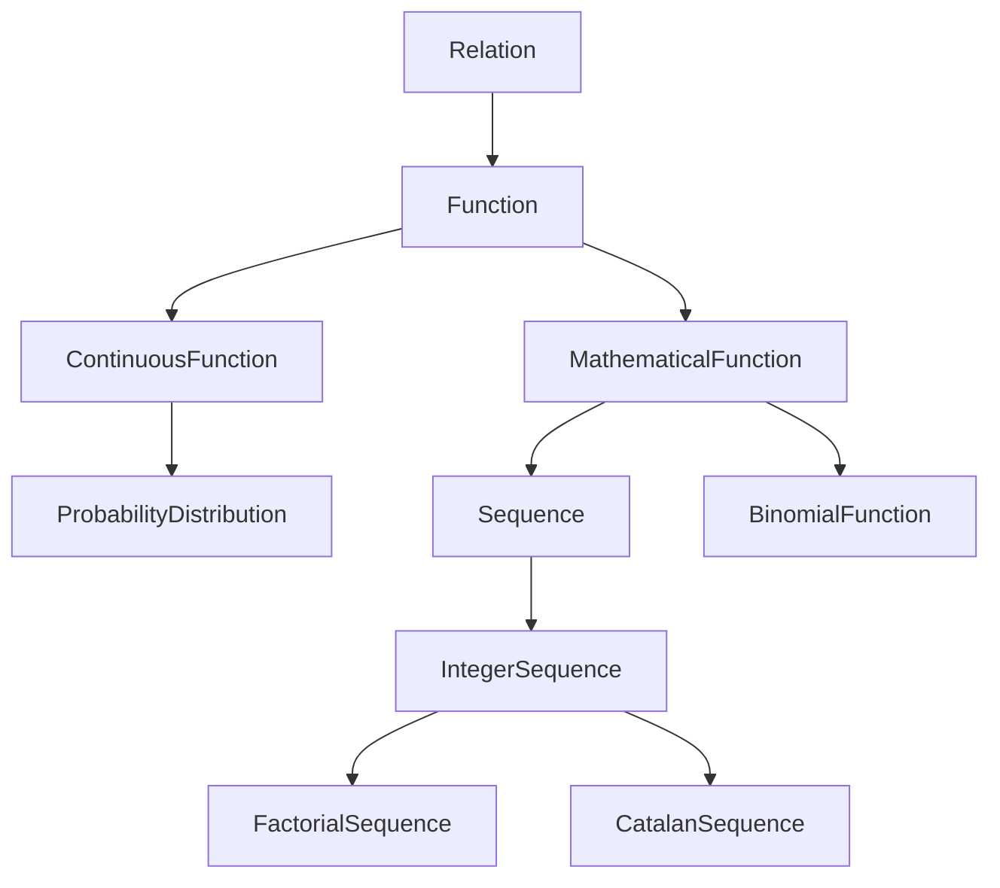

# Advanced Architecture Enhancements

Comprehensive architectural plan for backend abstraction, pluggable graph traversal, combinatorics redesign, and probability/statistics framework.

---

## 1. Backend Abstraction Layer (GPU/CPU/Quantum)

### Overview

Create a **pluggable backend system** that hides implementation details while allowing third-party backends (GPU accelerators, quantum machines, distributed systems).

### Architecture



### Implementation Plan

#### Core Backend Interface

**Package**: `org.jscience.backend`

```java
// Service Provider Interface
public interface ComputeBackend {
    String getName();
    boolean isAvailable();
    ExecutionContext createContext();
    
    // Capability flags
    boolean supportsParallelOps();
    boolean supportsFloatingPoint();
    boolean supportsComplexNumbers();
}

// Execution context for operations
public interface ExecutionContext extends AutoCloseable {
    <T> T execute(Operation<T> operation);
    void executeAsync(Operation<?> operation, Callback callback);
}
```

#### Backend Manager

```java
public class BackendManager {
    private static final Map<String, ComputeBackend> backends = new ConcurrentHashMap<>();
    private static ComputeBackend defaultBackend;
    
    static {
        // Auto-discover backends via ServiceLoader
        ServiceLoader.load(ComputeBackend.class)
            .forEach(backend -> registerBackend(backend));
        
        // Set default (prefer GPU, fallback to CPU)
        defaultBackend = selectBestBackend();
    }
    
    public static ComputeBackend getDefault() {
        return defaultBackend;
    }
    
    public static void setDefault(String name) {
        defaultBackend = backends.get(name);
    }
    
    // Allow manual backend selection
    public static ComputeBackend select(String name) {
        return backends.get(name);
    }
}
```

#### Operations API

```java
// Generic operation interface
public interface Operation<T> {
    T compute(ExecutionContext context);
}

// Matrix operations example
public interface MatrixOps {
    Matrix multiply(Matrix a, Matrix b);
    Matrix invert(Matrix m);
    Vector eigenvalues(Matrix m);
}
```

### Backend Implementations

#### CPU Backend (Default)

**Package**: `org.jscience.backend.cpu`

- Pure Java implementation
- Always available
- Uses Java parallel streams for parallelization

#### GPU Backend (Optional)

**Package**: `org.jscience.backend.gpu`

- JOCL (OpenCL) wrapper
- Auto-detected via `isAvailable()`
- Gracefully degrades to CPU if unavailable

#### Quantum Backend (Extension Point)

**Package**: Third-party, e.g., `com.example.quantum.jscience`

- SPI implementation
- Loaded via ServiceLoader
- Example: IBM Qiskit bridge, Rigetti, etc.

---

## 2. Pluggable Graph Traversal Strategies

### Overview

Redesign `Graph` to support **pluggable traversal algorithms** with backend acceleration.

### Current State

The current [`Graph`](file:///c:/Silvere/Encours/Developpement/JScience/src/main/java/org/jscience/mathematics/discrete/Graph.java) interface is minimal:
- Basic vertex/edge operations
- No traversal methods
- No backend support

### Enhanced Architecture

#### Graph Traversal SPI

**Package**: `org.jscience.mathematics.discrete.graph`

```java
public interface GraphTraversalStrategy<V> {
    /**
     * Traverses the graph and visits each vertex.
     * Backend-agnostic: implementation chooses CPU/GPU execution.
     */
    void traverse(Graph<V> graph, V start, VertexVisitor<V> visitor);
    
    /**
     * Allows backend selection override.
     */
    default void traverse(Graph<V> graph, V start, 
                         VertexVisitor<V> visitor, 
                         ComputeBackend backend) {
        traverse(graph, start, visitor);
    }
}

@FunctionalInterface
public interface VertexVisitor<V> {
    void visit(V vertex, int depth);
}
```

#### Standard Traversal Implementations

```java
// Depth-First Search
public class DFSTraversal<V> implements GraphTraversalStrategy<V> {
    @Override
    public void traverse(Graph<V> graph, V start, VertexVisitor<V> visitor) {
        // CPU implementation
        Set<V> visited = new HashSet<>();
        dfsRecursive(graph, start, visitor, visited, 0);
    }
    
    private void dfsRecursive(Graph<V> graph, V current, 
                             VertexVisitor<V> visitor, 
                             Set<V> visited, int depth) {
        if (visited.contains(current)) return;
        visited.add(current);
        visitor.visit(current, depth);
        
        for (V neighbor : graph.neighbors(current)) {
            dfsRecursive(graph, neighbor, visitor, visited, depth + 1);
        }
    }
}

// Breadth-First Search
public class BFSTraversal<V> implements GraphTraversalStrategy<V> {
    @Override
    public void traverse(Graph<V> graph, V start, VertexVisitor<V> visitor) {
        Queue<Pair<V, Integer>> queue = new LinkedList<>();
        Set<V> visited = new HashSet<>();
        
        queue.offer(new Pair<>(start, 0));
        visited.add(start);
        
        while (!queue.isEmpty()) {
            Pair<V, Integer> current = queue.poll();
            visitor.visit(current.first(), current.second());
            
            for (V neighbor : graph.neighbors(current.first())) {
                if (!visited.contains(neighbor)) {
                    visited.add(neighbor);
                    queue.offer(new Pair<>(neighbor, current.second() + 1));
                }
            }
        }
    }
}

// GPU-Accelerated BFS (for large graphs)
public class ParallelBFSTraversal<V> implements GraphTraversalStrategy<V> {
    private final ComputeBackend backend;
    
    public ParallelBFSTraversal() {
        this.backend = BackendManager.getDefault();
    }
    
    @Override
    public void traverse(Graph<V> graph, V start, VertexVisitor<V> visitor) {
        if (!backend.supportsParallelOps()) {
            // Fallback to standard BFS
            new BFSTraversal<V>().traverse(graph, start, visitor);
            return;
        }
        
        // GPU-accelerated traversal
        try (ExecutionContext ctx = backend.createContext()) {
            // Convert graph to adjacency matrix
            // Execute parallel frontier expansion
            // Visit vertices in parallel
        }
    }
}
```

#### Enhanced Graph Interface

```java
public interface Graph<V> {
    // ... existing methods ...
    
    /**
     * Traverses the graph using the specified strategy.
     */
    default void traverse(V start, GraphTraversalStrategy<V> strategy, 
                         VertexVisitor<V> visitor) {
        strategy.traverse(this, start, visitor);
    }
    
    /**
     * Convenience methods for common traversals.
     */
    default void dfs(V start, VertexVisitor<V> visitor) {
        traverse(start, new DFSTraversal<>(), visitor);
    }
    
    default void bfs(V start, VertexVisitor<V> visitor) {
        traverse(start, new BFSTraversal<>(), visitor);
    }
    
    /**
     * GPU-accelerated traversal for large graphs.
     */
    default void parallelBfs(V start, VertexVisitor<V> visitor) {
        traverse(start, new ParallelBFSTraversal<>(), visitor);
    }
}
```

### Graph Algorithms with Backend Support

#### Shortest Path

```java
public interface ShortestPathStrategy<V> {
    List<V> findPath(Graph<V> graph, V start, V end);
}

public class DijkstraStrategy<V> implements ShortestPathStrategy<V> {
    // CPU implementation
}

public class ParallelDijkstraStrategy<V> implements ShortestPathStrategy<V> {
    // GPU-accelerated for large graphs
}
```

#### Connected Components

```java
public interface ComponentAnalysis<V> {
    Set<Set<V>> findComponents(Graph<V> graph);
}

public class UnionFindComponents<V> implements ComponentAnalysis<V> {
    // CPU implementation
}

public class ParallelComponents<V> implements ComponentAnalysis<V> {
    // GPU-accelerated using parallel label propagation
}
```

---

## 3. Combinatorics as Functions/Sequences

### Overview

Reimplement [`Combinatorics`](file:///c:/Silvere/Encours/Developpement/JScience/src/main/java/org/jscience/mathematics/discrete/Combinatorics.java) as **functions** and **sequences** rather than static utility methods.

### Current Issues

- Static methods: `factorial(n)`, `binomial(n, k)`
- Not composable
- Cannot be used where functions are expected
- No OEIS integration

### Redesign as Functions

#### Factorial as Sequence

```java
/**
 * Factorial sequence: a(n) = n!
 * OEIS: A000142
 */
public class FactorialSequence implements IntegerSequence {
    
    @Override
    public BigInteger get(int n) {
        if (n < 0) throw new IllegalArgumentException("n must be non-negative");
        
        BigInteger result = BigInteger.ONE;
        for (int i = 2; i <= n; i++) {
            result = result.multiply(BigInteger.valueOf(i));
        }
        return result;
    }
    
    @Override
    public String getOeisId() {
        return "A000142";
    }
    
    @Override
    public String getName() {
        return "Factorial";
    }
    
    @Override
    public String getFormula() {
        return "a(n) = n!";
    }
}
```

#### Binomial Coefficients as 2D Function

```java
/**
 * Binomial coefficient function: C(n, k)
 * Represents Pascal's triangle.
 */
public class BinomialFunction implements MathematicalFunction<Pair<Integer, Integer>, BigInteger> {
    
    @Override
    public BigInteger evaluate(Pair<Integer, Integer> nk) {
        int n = nk.first();
        int k = nk.second();
        
        if (k < 0 || k > n) return BigInteger.ZERO;
        if (k > n - k) k = n - k;
        
        BigInteger result = BigInteger.ONE;
        for (int i = 0; i < k; i++) {
            result = result.multiply(BigInteger.valueOf(n - i))
                          .divide(BigInteger.valueOf(i + 1));
        }
        return result;
    }
    
    @Override
    public String getDomain() {
        return "ℕ × ℕ";
    }
    
    @Override
    public String getCodomain() {
        return "ℕ";
    }
    
    /**
     * Returns the n-th row of Pascal's triangle as a sequence.
     */
    public IntegerSequence row(int n) {
        return k -> evaluate(new Pair<>(n, k));
    }
    
    /**
     * Returns the k-th diagonal of Pascal's triangle as a sequence.
     */
    public IntegerSequence diagonal(int k) {
        return n -> evaluate(new Pair<>(n, k));
    }
}
```

#### Catalan Numbers as Sequence

Already implemented in [`CatalanSequence`](file:///c:/Silvere/Encours/Developpement/JScience/src/main/java/org/jscience/mathematics/analysis/series/CatalanSequence.java).

### Migration Strategy

1. **Keep static utilities** in `Combinatorics` for convenience
2. **Delegate to function/sequence implementations**
3. **Add functional alternatives**

```java
public class Combinatorics {
    // Static shortcuts (backward compatible)
    public static BigInteger factorial(int n) {
        return FACTORIAL.get(n);
    }
    
    public static BigInteger binomial(int n, int k) {
        return BINOMIAL.evaluate(new Pair<>(n, k));
    }
    
    // Functional instances
    public static final IntegerSequence FACTORIAL = new FactorialSequence();
    public static final BinomialFunction BINOMIAL = new BinomialFunction();
    public static final IntegerSequence CATALAN = new CatalanSequence();
}
```

---

## 4. Probability & Statistics Framework

### Overview

Create a comprehensive **probability and statistics package** based on V1 implementation, redesigned as **functions** extending the type hierarchy.

### V1 Analysis

The V1 statistics package ([`Distribution.java`](file:///c:/Silvere/Encours/Developpement/JScience/jscience-old-v1/src/org/jscience/mathematics/statistics/Distribution.java)) contains:

- 46 distribution classes
- Abstract `Distribution` base class
- PDF, CDF, quantile, moment methods
- Discrete vs. continuous distinction

**Issues with V1**:
- Not integrated with function hierarchy
- Domain represented as double, not typed
- No composition/transformation support

### Redesign as Function Hierarchy

#### Base Distribution Interface

**Package**: `org.jscience.mathematics.statistics`

```java
/**
 * A probability distribution P(X ≤ x).
 * This is a mathematical function from ℝ → [0, 1].
 */
public interface ProbabilityDistribution extends ContinuousFunction<Double, Double> {
    
    /**
     * Probability density function (PDF) or probability mass function (PMF).
     * f(x) = dP/dx for continuous, P(X = x) for discrete.
     */
    double density(double x);
    
    /**
     * Cumulative distribution function (CDF).
     * F(x) = P(X ≤ x)
     */
    double cdf(double x);
    
    /**
     * Quantile function (inverse CDF).
     * Q(p) = F⁻¹(p)
     */
    double quantile(double p);
    
    /**
     * Generate random sample from this distribution.
     */
    double sample();
    
    /**
     * Statistical moments.
     */
    double mean();
    double variance();
    default double standardDeviation() {
        return Math.sqrt(variance());
    }
    double moment(int n);
    
    /**
     * Function interface - delegates to CDF.
     */
    @Override
    default Double evaluate(Double x) {
        return cdf(x);
    }
    
    /**
     * Is this a discrete or continuous distribution?
     */
    boolean isDiscrete();
}
```

#### Abstract Base Classes

```java
public abstract class ContinuousDistribution implements ProbabilityDistribution {
    @Override
    public boolean isDiscrete() {
        return false;
    }
    
    @Override
    public double cdf(double x) {
        // Numerical integration of PDF
        return numericalIntegral(Double.NEGATIVE_INFINITY, x, this::density);
    }
    
    @Override
    public double quantile(double p) {
        // Bisection search on CDF
        return inverseFunction(this::cdf, p);
    }
    
    @Override
    public double sample() {
        return quantile(Math.random());
    }
}

public abstract class DiscreteDistribution implements ProbabilityDistribution {
    @Override
    public boolean isDiscrete() {
        return true;
    }
    
    /**
     * Support: the set of values with non-zero probability.
     */
    public abstract Set<Integer> support();
    
    @Override
    public double cdf(double x) {
        double sum = 0;
        for (int k : support()) {
            if (k <= x) sum += density(k);
            else break;
        }
        return sum;
    }
}
```

#### Standard Distributions

##### Normal Distribution

```java
/**
 * Normal (Gaussian) distribution N(μ, σ²).
 */
public class NormalDistribution extends ContinuousDistribution {
    private final double mu;
    private final double sigma;
    
    public NormalDistribution(double mu, double sigma) {
        if (sigma <= 0) throw new IllegalArgumentException("sigma must be positive");
        this.mu = mu;
        this.sigma = sigma;
    }
    
    public NormalDistribution() {
        this(0, 1); // Standard normal
    }
    
    @Override
    public double density(double x) {
        double z = (x - mu) / sigma;
        return Math.exp(-z * z / 2) / (sigma * Math.sqrt(2 * Math.PI));
    }
    
    @Override
    public double cdf(double x) {
        double z = (x - mu) / sigma;
        return 0.5 * (1 + erf(z / Math.sqrt(2)));
    }
    
    @Override
    public double mean() {
        return mu;
    }
    
    @Override
    public double variance() {
        return sigma * sigma;
    }
    
    @Override
    public double sample() {
        // Box-Muller transform
        double u1 = Math.random();
        double u2 = Math.random();
        double z = Math.sqrt(-2 * Math.log(u1)) * Math.cos(2 * Math.PI * u2);
        return mu + sigma * z;
    }
}
```

##### Binomial Distribution

```java
/**
 * Binomial distribution B(n, p).
 */
public class BinomialDistribution extends DiscreteDistribution {
    private final int n;
    private final double p;
    private final BinomialFunction binomial = new BinomialFunction();
    
    public BinomialDistribution(int n, double p) {
        if (n < 0) throw new IllegalArgumentException("n must be non-negative");
        if (p < 0 || p > 1) throw new IllegalArgumentException("p must be in [0, 1]");
        this.n = n;
        this.p = p;
    }
    
    @Override
    public Set<Integer> support() {
        return IntStream.rangeClosed(0, n).boxed().collect(Collectors.toSet());
    }
    
    @Override
    public double density(double k) {
        if (k < 0 || k > n || k != Math.floor(k)) return 0;
        
        BigInteger coeff = binomial.evaluate(new Pair<>(n, (int) k));
        return coeff.doubleValue() * Math.pow(p, k) * Math.pow(1 - p, n - k);
    }
    
    @Override
    public double mean() {
        return n * p;
    }
    
    @Override
    public double variance() {
        return n * p * (1 - p);
    }
}
```

##### Exponential Distribution

```java
/**
 * Exponential distribution Exp(λ).
 */
public class ExponentialDistribution extends ContinuousDistribution {
    private final double lambda;
    
    public ExponentialDistribution(double lambda) {
        if (lambda <= 0) throw new IllegalArgumentException("lambda must be positive");
        this.lambda = lambda;
    }
    
    @Override
    public double density(double x) {
        return x < 0 ? 0 : lambda * Math.exp(-lambda * x);
    }
    
    @Override
    public double cdf(double x) {
        return x < 0 ? 0 : 1 - Math.exp(-lambda * x);
    }
    
    @Override
    public double quantile(double p) {
        if (p < 0 || p > 1) throw new IllegalArgumentException("p must be in [0, 1]");
        return -Math.log(1 - p) / lambda;
    }
    
    @Override
    public double mean() {
        return 1 / lambda;
    }
    
    @Override
    public double variance() {
        return 1 / (lambda * lambda);
    }
}
```

### Distribution Families

#### Location-Scale Family

```java
/**
 * Location-scale family: f((x - μ) / σ).
 */
public class LocationScaleDistribution extends ContinuousDistribution {
    private final ProbabilityDistribution baseDistribution;
    private final double location;
    private final double scale;
    
    public LocationScaleDistribution(ProbabilityDistribution base, 
                                    double location, double scale) {
        this.baseDistribution = base;
        this.location = location;
        this.scale = scale;
    }
    
    @Override
    public double density(double x) {
        double z = (x - location) / scale;
        return baseDistribution.density(z) / scale;
    }
    
    @Override
    public double cdf(double x) {
        double z = (x - location) / scale;
        return baseDistribution.cdf(z);
    }
    
    @Override
    public double mean() {
        return location + scale * baseDistribution.mean();
    }
    
    @Override
    public double variance() {
        return scale * scale * baseDistribution.variance();
    }
}
```

### Statistical Functions

#### Empirical Distribution Function

```java
/**
 * Empirical CDF from sample data.
 */
public class EmpiricalDistribution implements ProbabilityDistribution {
    private final double[] data;
    
    public EmpiricalDistribution(double[] data) {
        this.data = data.clone();
        Arrays.sort(this.data);
    }
    
    @Override
    public double density(double x) {
        // For empirical: count exact matches
        long count = Arrays.stream(data).filter(d -> d == x).count();
        return count / (double) data.length;
    }
    
    @Override
    public double cdf(double x) {
        long count = Arrays.stream(data).filter(d -> d <= x).count();
        return count / (double) data.length;
    }
    
    @Override
    public boolean isDiscrete() {
        return false; // Mixed, actually
    }
}
```

### Package Structure

```
org.jscience.mathematics.statistics/
├── ProbabilityDistribution.java
├── ContinuousDistribution.java
├── DiscreteDistribution.java
├── LocationScaleDistribution.java
├── EmpiricalDistribution.java
├── continuous/
│   ├── NormalDistribution.java
│   ├── ExponentialDistribution.java
│   ├── GammaDistribution.java
│   ├── BetaDistribution.java
│   ├── CauchyDistribution.java
│   ├── LogNormalDistribution.java
│   ├── UniformDistribution.java
│   ├── StudentTDistribution.java
│   ├── ChiSquaredDistribution.java
│   └── FDistribution.java
├── discrete/
│   ├── BinomialDistribution.java
│   ├── PoissonDistribution.java
│   ├── GeometricDistribution.java
│   ├── HypergeometricDistribution.java
│   ├── NegativeBinomialDistribution.java
│   └── DiscreteUniformDistribution.java
└── estimators/
    ├── MaximumLikelihood.java
    ├── MomentEstimator.java
    └── BayesianEstimator.java
```

---

## 5. Integration with Existing Architecture

### Function Hierarchy Integration



### Backend Integration

- **Matrix operations**: Use in linear algebra package
- **FFT**: Use in transforms
- **Graph algorithms**: Large-scale network analysis
- **Monte Carlo**: Parallel sampling in statistics

### OEIS Integration

Combinatorial sequences are already OEIS-compatible via [`Sequence`](file:///c:/Silvere/Encours/Developpement/JScience/src/main/java/org/jscience/mathematics/analysis/series/Sequence.java) interface:

```java
// Factorial: A000142
// Catalan: A000108
// Binomial row n=5: A000389 (5th row of Pascal's triangle)
```

---

## 6. Implementation Roadmap

### Phase 1: Backend Abstraction (Priority: High)

1. Create `org.jscience.backend` package
2. Implement `ComputeBackend` SPI
3. Implement `CPUBackend` (default)
4. Implement `BackendManager`
5. **Testing**: Verify ServiceLoader discovery

### Phase 2: Graph Traversal (Priority: Medium)

1. Create `org.jscience.mathematics.discrete.graph` package
2. Implement `GraphTraversalStrategy` interface
3. Implement `DFSTraversal`, `BFSTraversal`
4. Add traversal methods to `Graph` interface
5. Implement shortest path algorithms
6. **Optional**: GPU-accelerated traversal

### Phase 3: Combinatorics Redesign (Priority: Low)

1. Create `BinomialFunction` extending `MathematicalFunction`
2. Ensure `FactorialSequence`, `CatalanSequence` exist
3. Update `Combinatorics` to delegate to functional implementations
4. Add Stirling numbers, partitions as sequences

### Phase 4: Statistics Framework (Priority: High)

1. Create `org.jscience.mathematics.statistics` package
2. Implement `ProbabilityDistribution` interface
3. Implement `ContinuousDistribution` and `DiscreteDistribution` bases
4. Port V1 distributions:
   - Normal, Exponential, Gamma, Beta (continuous)
   - Binomial, Poisson, Geometric (discrete)
5. Add `EmpiricalDistribution`
6. Add statistical estimators
7. **Testing**: Verify against known distribution properties

### Phase 5: GPU Backend (Optional)

1. Implement `GPUBackend` using JOCL
2. Add GPU matrix operations
3. Add GPU-accelerated FFT
4. Add GPU graph traversal
5. **Fallback**: Graceful degradation to CPU

---

## 7. User Experience

### Transparent Backend Usage

```java
// User never sees backend explicitly
Matrix result = a.multiply(b); // Uses GPU if available

// Advanced users can override
Matrix result = a.multiply(b, BackendManager.select("CPU"));
```

### Pluggable Traversal

```java
Graph<String> graph = new DirectedGraph<>();
// ... populate graph ...

// DFS traversal
graph.dfs("start", (vertex, depth) -> {
    System.out.println(" ".repeat(depth) + vertex);
});

// GPU-accelerated for large graphs
if (graph.vertices().size() > 10000) {
    graph.parallelBfs("start", visitor);
}
```

### Combinatorics as Functions

```java
// Functional style
IntegerSequence factorial = Combinatorics.FACTORIAL;
BigInteger f10 = factorial.get(10);

// Generate binomial coefficients
BinomialFunction binom = new BinomialFunction();
IntegerSequence row5 = binom.row(5); // 1, 5, 10, 10, 5, 1
```

### Distributions as Functions

```java
// Create distribution
ProbabilityDistribution normal = new NormalDistribution(0, 1);

// Use as function (CDF)
double prob = normal.evaluate(1.96); // P(X ≤ 1.96) ≈ 0.975

// Statistical methods
System.out.println("Mean: " + normal.mean());
System.out.println("P(X ≤ 0): " + normal.cdf(0));
System.out.println("Median: " + normal.quantile(0.5));

// Generate samples
double[] samples = IntStream.range(0, 1000)
    .mapToDouble(i -> normal.sample())
    .toArray();
```

---

## 8. Third-Party Extension Examples

### Custom Quantum Backend

```java
package com.example.quantum;

public class QuantumBackend implements ComputeBackend {
    @Override
    public String getName() {
        return "IBM-Qiskit";
    }
    
    @Override
    public boolean isAvailable() {
        // Check if Qiskit API is accessible
        return QiskitRuntime.isConnected();
    }
    
    @Override
    public ExecutionContext createContext() {
        return new QiskitExecutionContext();
    }
    
    // Register via META-INF/services/org.jscience.backend.ComputeBackend
}
```

### Custom Graph Algorithm

```java
package com.example.algorithms;

public class PageRankTraversal<V> implements GraphTraversalStrategy<V> {
    private final int iterations;
    private final double dampingFactor;
    
    @Override
    public void traverse(Graph<V> graph, V start, VertexVisitor<V> visitor) {
        Map<V, Double> ranks = computePageRank(graph);
        
        // Visit in descending rank order
        ranks.entrySet().stream()
            .sorted(Map.Entry.<V, Double>comparingByValue().reversed())
            .forEach(e -> visitor.visit(e.getKey(), 0));
    }
}
```

---

## Summary

This architecture plan provides:

1. ✅ **Backend abstraction**: Hidden GPU/CPU/quantum backends via SPI
2. ✅ **Pluggable graph traversal**: Strategy pattern with backend support
3. ✅ **Combinatorics as functions**: Integration with sequence/function hierarchy
4. ✅ **Statistics framework**: 40+ distributions as functions
5. ✅ **Third-party extensibility**: ServiceLoader-based plugin system
6. ✅ **Graceful degradation**: CPU fallback always available

### Key Design Principles

- **Abstraction without leakage**: Users don't see backends unless they want to
- **Composability**: Functions, sequences, distributions all interoperate
- **Extensibility**: SPI allows third-party implementations
- **Performance**: GPU acceleration available but optional
- **Compatibility**: V1 statistics functionality preserved

All components integrate seamlessly with the existing JScience architecture while providing modern, flexible APIs for advanced use cases.
