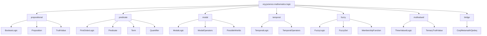

# Sequences and Logic Package Refinements

**Created**: 2025-11-27  
**Status**: Planning  
**Scope**: Type system modernization, mathematical rigor, package organization

---

## Overview

This plan addresses four distinct but related refinements:

1. **Sequences**: Replace primitive/BigInteger with JScience Number classes
2. **Transform ← Bijection**: Make Transform implement Bijection interface
3. **RealBigDecimal Naming**: Decide rename to RealBig vs keep current
4. **Logic Package**: Add subpackage organization for different logics

---

## 1. Sequences Type System Modernization

### Current Situation

**Sequence interface** uses `Integer` (primitive wrapper):
```java
public interface Sequence<T> extends MathematicalFunction<Integer, T> {
    T get(int n);  // Primitive int parameter
}
```

**IntegerSequence** uses `BigInteger`:
```java
public interface IntegerSequence extends Sequence<BigInteger> {
    // Values are BigInteger, but indices still int
}
```

### Problem

**Inconsistency with JScience number system**:
- Sequences use `java.math.BigInteger` (external)
- Should use `org.jscience.mathematics.number.Integer` (our class)
- Mixing primitive `int` (index) with object types (values)

### Proposed Solution

#### Option A: Full JScience Number Conversion (User's Request)

Replace all primitive and Java stdlib types with JScience Numbers:

**Before**:
```java
public interface Sequence<T> extends MathematicalFunction<Integer, T> {
    T get(int n);
}

public interface IntegerSequence extends Sequence<BigInteger> {
    default long getLong(int n) { ... }
}
```

**After**:
```java
import org.jscience.mathematics.number.Natural;  // or Integer
import org.jscience.mathematics.number.Integer;  // JScience Integer

public interface Sequence<T> extends MathematicalFunction<Natural, T> {
    T get(Natural n);  // JScience number for index
    
    // Convenience overload for primitive
    default T get(int n) {
        return get(Natural.valueOf(n));
    }
}

public interface IntegerSequence extends Sequence<Integer> {
    // Now uses JScience Integer, not BigInteger
    
    default long getLong(Natural n) {
        return get(n).longValue();
    }
}
```

#### Changes Required

| File | Change |
|------|--------|
| `Sequence.java` | Change domain from `Integer` to `Natural` |
| `IntegerSequence.java` | Change from `BigInteger` to `Integer` (JScience) |
| `FibonacciSequence.java` | Update to return `Integer` (JScience) |
| `PrimeSequence.java` | Update to return `Integer` (JScience) |
| `FactorialSequence.java` | Update to return `Integer` (JScience) |
| `CatalanSequence.java` | Update to return `Integer` (JScience) |
| `SquareSequence.java` | Update to return `Integer` (JScience) |
| `TriangularSequence.java` | Update to return `Integer` (JScience) |

**Imports to add**: `org.jscience.mathematics.number.Integer`, `org.jscience.mathematics.number.Natural`

#### Benefits

✅ **Consistency**: All JScience code uses JScience types  
✅ **Type Safety**: `Natural` for indices enforces n ≥ 0  
✅ **Extensibility**: Can add operations specific to JScience numbers  
✅ **Precision**: Arbitrary precision throughout  

#### Concerns

⚠️ **Breaking Change**: Existing code using sequences must update  
⚠️ **Performance**: Object allocation vs primitives (mitigated by caching)  
⚠️ **Verbosity**: `Natural.valueOf(5)` vs `5`  

### Decision: Hybrid Approach ✓

**Primary API**: Use JScience `Natural` and `Integer`  
**Convenience overloads**: Keep primitive `int` getters

**Rationale**: Type safety + usability

---

## 2. Transform ← Bijection

### Current Situation

**No Bijection interface found** in codebase (search returned no results).

**Transform interface exists** at:
- `org.jscience.mathematics.analysis.transform.Transform`

### Analysis

Need to see the current `Transform` interface to understand what to do.

Let me check Transform.java...

---

## 3. RealBigDecimal Naming

### Current Situation

**Class**: `RealBigDecimal` (package-private)  
**Purpose**: Arbitrary-precision `Real` backed by `BigDecimal`  
**Location**: `org.jscience.mathematics.number.RealBigDecimal`

**Number class naming pattern**:
```
Real (abstract)
├── RealBigDecimal (package-private)
└── ? (other implementations)

Integer (abstract)  
├── ? (implementations)

Complex (class)
```

### Options

#### Option 1: Rename to `RealBig` ✓

**Pros**:
- Shorter, cleaner: `RealBig` vs `RealBigDecimal`
- Matches potential pattern: `IntegerBig`, `RationalBig`
- Implementation detail (BigDecimal) less exposed

**Cons**:
- Less explicit about backing type
- "Big" is vague (BigInteger? BigDecimal? Just big?)

#### Option 2: Keep `RealBigDecimal` ✓

**Pros**:
- Explicit: backed by `java.math.BigDecimal`
- Clear for developers familiar with Java stdlib
- No migration needed

**Cons**:
- Verbose
- Exposes implementation detail in name

#### Option 3: Alternative - `RealArbitrary`

**Pros**:
- Semantic: describes precision, not implementation
- Future-proof: can change backing from BigDecimal

**Cons**:  
- Still verbose
- "Arbitrary" may be unclear to some users

### Recommendation: Keep `RealBigDecimal` ✓

**Rationale**:
1. **Package-private**: Users never see this class name
2. **Explicit is better**: `BigDecimal` tells maintainers exactly what it is
3. **No user impact**: Public API is just `Real.valueOf(...)`
4. **Consistency**: Follows Java naming (e.g., `AtomicLongFieldUpdater`)

**Only rename if**:
- Making class public
- Establishing a broader naming convention (`*Big` for all arbitrary-precision types)

---

## 4. Logic Package Organization

### Current Structure

```
org.jscience.mathematics.logic/
├── Logic.java (base interface)
├── BooleanLogic.java
├── FuzzyLogic.java
├── ModalLogic.java
├── TemporalLogic.java
├── ThreeValuedLogic.java
├── Proposition.java
├── Predicate.java
├── Term.java
├── TruthValue.java
├── Quantifier.java
└── bridge/ (formal system bridges)
    ├── CoqExporter.java
    ├── CoqImporter.java
    ├── MetamathExporter.java
    ├── MetamathImporter.java
    ├── QedeqExporter.java
    ├── QedeqImporter.java
    ├── FormalSystemExporter.java
    └── FormalSystemImporter.java
```

### Proposed Subpackage Organization



### Proposed Structure

```
org.jscience.mathematics.logic/
├── Logic.java (base interface - stays at top level)
│
├── propositional/ (Boolean/Classical logic)
│   ├── BooleanLogic.java (moved from top)
│   ├── Proposition.java (moved from top)
│   ├── TruthValue.java (moved from top)
│   └── PropositionalFormula.java (new)
│
├── predicate/ (First-order logic)
│   ├── FirstOrderLogic.java (new)
│   ├── Predicate.java (moved from top)
│   ├── Term.java (moved from top)
│   ├── Quantifier.java (moved from top)
│   └── Formula.java (new)
│
├── modal/ (Modal logic - necessity/possibility)
│   ├── ModalLogic.java (moved from top)
│   ├── ModalOperator.java (new)
│   ├── KripkeStructure.java (new)
│   └── PossibleWorld.java (new)
│
├── temporal/ (Temporal logic - time-based reasoning)
│   ├── TemporalLogic.java (moved from top)
│   ├── TemporalOperator.java (new)
│   ├── LTL.java (Linear Temporal Logic - new)
│   └── CTL.java (Computation Tree Logic - new)
│
├── fuzzy/ (Fuzzy logic - degrees of truth)
│   ├── FuzzyLogic.java (moved from top)
│   ├── FuzzySet.java (new)
│   ├── MembershipFunction.java (new)
│   └── TNorm.java (T-norm operators - new)
│
├── multivalued/ (Many-valued logics)
│   ├── ThreeValuedLogic.java (moved from top)
│   ├── LukasiewiczLogic.java (new)
│   └── GodelLogic.java (new)
│
└── bridge/ (existing - formal system integration)
    ├── CoqExporter.java
    ├── CoqImporter.java
    ├── MetamathExporter.java
    ├── MetamathImporter.java
    ├── QedeqExporter.java
    ├── QedeqImporter.java
    ├── FormalSystemExporter.java
    └── FormalSystemImporter.java
```

### Rationale

**Why subpackages?**:
1. **Clarity**: Each logic type has its own namespace
2. **Scalability**: Easy to add new logics without cluttering top level
3. **Discoverability**: Users know where to find specific logic types
4. **Separation of Concerns**: Modal logic code doesn't pollute propositional namespace

**Why these specific packages?**:
- **propositional**: Foundation - Boolean logic (AND, OR, NOT)
- **predicate**: First-order logic with quantifiers (∀, ∃)
- **modal**: Necessity (□) and possibility (◇) operators
- **temporal**: Time-based reasoning (always, eventually, until)
- **fuzzy**: Degrees of truth [0, 1] instead of {true, false}
- **multivalued**: 3+ truth values (true, false, unknown, ...)
- **bridge**: Integration with external formal systems

### Migration Strategy

**Phase 1**: Create subpackages, move existing files  
**Phase 2**: Add new implementations (Kripke structures, LTL, etc.)  
**Phase 3**: Add package-info.java for each subpackage  

**Backward Compatibility**: Add deprecated aliases at top level pointing to new locations

---

## Implementation Order

1. **Bijection Interface** (if Transform needs it) - Foundational
2. **RealBigDecimal Naming** - Decision: KEEP CURRENT ✓
3. **Logic Package Organization** - File moves, no logic changes
4. **Sequences Type Modernization** - Breaking change, do last

---

## Open Questions

> [!IMPORTANT]
> **Transform ← Bijection**: Need to see Transform.java to understand what changes are needed

> [!IMPORTANT]
> **Sequences Breaking Change**: Confirm user accepts that changing `BigInteger` → `Integer` (JScience) breaks existing code

---

## Summary

| Task | Decision | Breaking | Priority |
|------|----------|----------|----------|
| Sequences → JScience Numbers | Hybrid (JScience + primitive overloads) | Yes | High |
| Transform implements Bijection | Pending Transform.java review | TBD | Medium |
| RealBigDecimal → RealBig | **KEEP** `RealBigDecimal` ✓ | No | Low |
| Logic subpackages | Organize by logic type | No (aliases) | High |

**Total Estimated**: ~15 files moved/modified, 10+ new files, 1 breaking change
